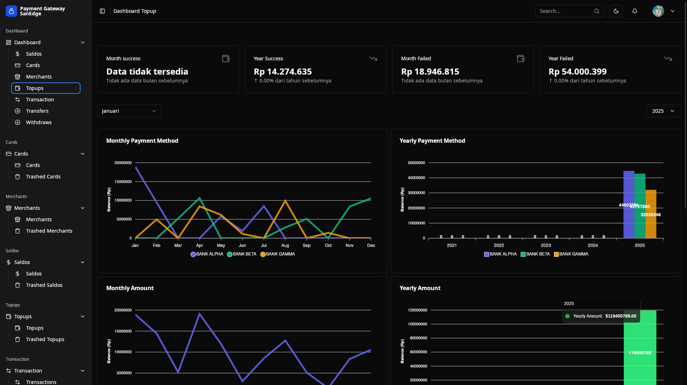

## Payment gateway Echo dengan Grpc

### **Welcome to the Payment Gateway Project!**
This system simulates a payment gateway handling operations such as card transactions, top-ups, withdrawals, and transfers. The project involves multiple entities like users, cards, merchants, and financial transactions.

### TechStack
- Golang
- Sqlc
- Echo Framework
- Grpc

## Preview Relation Table, Swagger, Frontend(web || desktop)

### Frontend

#### Frontend Web

#### Frontend Desktop

### Relation Table

### Swagger

